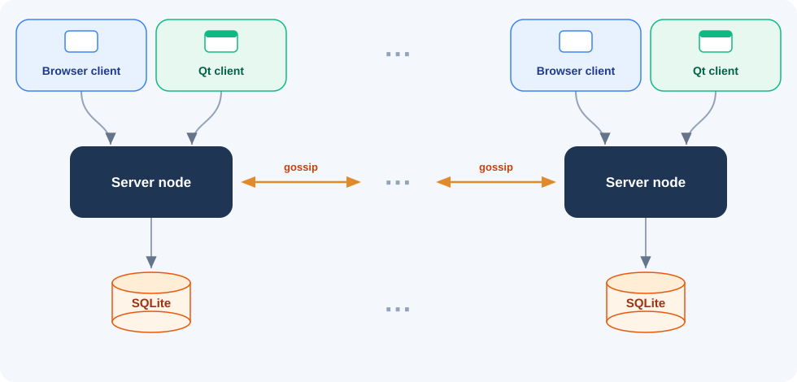
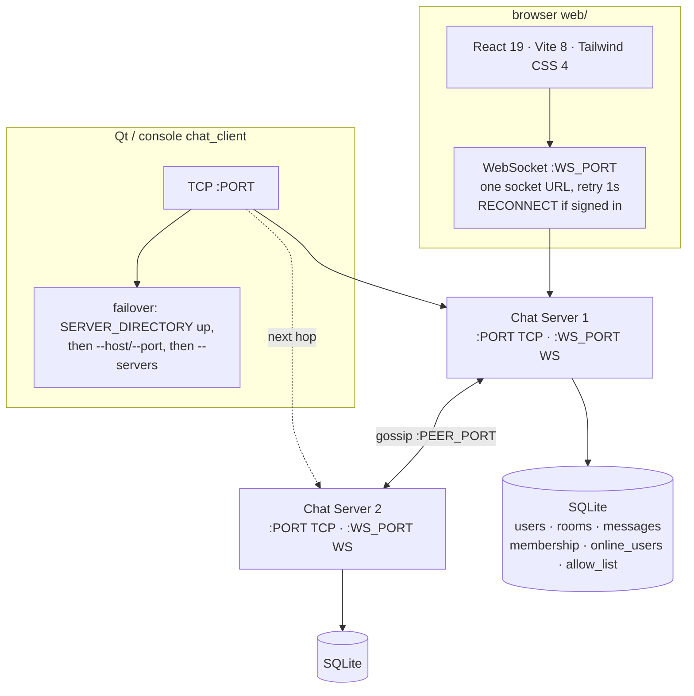

# Distributed Chat Server

         

C++17 chat cluster for Windows. Clients talk to a TCP server over framed binary packets; servers gossip with each other so presence, membership, and messages stay in sync across nodes.



Chat state is the SQLite file on each node. A later website database, if one is added, is website metadata only and stays off this path.

Qt dashboards ship on `chat_client` and `chat_server` (default). Pass `--test` for the console UIs used by scripts and Catch2. Passwords are hashed with Argon2id. Each node keeps its own SQLite file and replicates events over gossip rather than sharing a single store.

**Docs to read next**


| Doc                                | What it covers                                                             |
| ---------------------------------- | -------------------------------------------------------------------------- |
| [architecture.md](architecture.md) | Layered classes, Mermaid diagrams, client/server call paths, wire sequence |
| [database.md](database.md)         | Per-node SQLite schema, ER model, `allow_list`, query catalog, write paths |
| [tests/TESTS.md](tests/TESTS.md)   | Catch2 catalog and remaining gaps                                          |
| [FUTURE_WORK.md](FUTURE_WORK.md)   | Backlog and open work                                                      |
| [web/README.md](web/README.md)     | Browser dashboard: Vite app, WebSocket, scripts                            |


## Features

- **Auth** — register, login, logout, and profile update with Argon2id; one live session per user across the cluster
- **Rooms** — public / private rooms, join / leave (back to Lobby), create, invite to private rooms (`allow_list`)
- **Messages** — persist for registered users, live broadcast (including guests), rumor to peer nodes, history load
- **Heartbeat** — server pings; client auto-replies `pong`; stale sockets are closed
- **Client failover** — `--host`/`--port` and `--servers` merge with `SERVER_DIRECTORY`; endpoints the last directory reported as up are tried first; console and Qt show `reconnecting...` during a hop; a logged-in client sends `RECONNECT` so the new node takes presence and membership
- **Gossip** — `HELLO`, `EVENT`, `DIGEST`, and `PULL` with periodic anti-entropy
- **Qt GUI** — client chat dashboard (light/dark and comfortable/compact) and server Ports / Users / Rooms / Log panels (console via `--test`)
- **Browser** — the same dashboard in `web/`: React 19, Vite 8, Tailwind CSS 4, over a WebSocket of the same `Packet` frames


## Architecture




A Qt or console client walks that failover list when the current socket fails. The browser opens `--ws-port` on the URL in `VITE_SERVER_URL` and retries that same URL. Neither client dials `--peers`. `--peers` is server-to-server gossip only.

**Client path.** The Qt dashboard (or `ConsoleUI`) calls `Client` action methods. `PacketBuilder` builds the `Packet`; `Network` writes it (background reader pongs heartbeats, applies `ROOM_LIST`, and queues `MESSAGE` pushes for the UI). The server `ConnectionManager` accepts the connection, owns a `ClientSession`, and hands the packet to `PacketProcessor`.

**Server path.** `PacketProcessor` authenticates against `DatabaseManager`, updates `RoomManager`, and rumors a `GOSSIP_EVENT` through `GossipManager`. Gossip applies the event locally (persist + optional room broadcast) and forwards it to peers. Anti-entropy digests catch nodes that missed a rumor.

For class diagrams and sequences, see **[architecture.md](architecture.md)**. For the SQLite layout and gossip-related persistence, see **[database.md](database.md)**.

**Wire format.** Length-prefixed binary frames, max 1 MiB payload:

```
[u32 BE size][u8 type][u64 BE timestamp][u32 BE responseCode]
  then sender, receiver, room, message as [u32 BE length][bytes]
```

Gossip event bodies use five length-prefixed fields (`type`, `eventId`, `username`, `content`, `field5`) so payloads may contain `|`.

## Packet types


| Type                                                              | Role                                                                                                                                                                                                                                |
| ----------------------------------------------------------------- | ----------------------------------------------------------------------------------------------------------------------------------------------------------------------------------------------------------------------------------- |
| `LOGIN` / `REGISTER` / `LOGOUT`                                   | Session lifecycle; login/register success puts room directory in `room`                                                                                                                                                             |
| `RECONNECT`                                                       | Resume a logged-in session on a new socket (`sender` = username, `room` = current room). Success puts the room directory in `room` and moves `online_users` / `membership` to this `node_id` when that `node_id` is not a live peer |
| `ROOM_JOIN` / `ROOM_LEAVE`                                        | Membership (`LEAVE` returns to Lobby)                                                                                                                                                                                               |
| `ROOM_CREATE`                                                     | Create room (`room` = name, `message` = optional privacy)                                                                                                                                                                           |
| `ROOM_INVITE`                                                     | Allow-list a user for a private room                                                                                                                                                                                                |
| `ROOM_LIST`                                                       | Server push of full directory (`responseCode == 0`, body in `message`)                                                                                                                                                              |
| `SERVER_DIRECTORY`                                                | Push of live chat `host:port` endpoints (`responseCode == 0`, body in `message`)                                                                                                                                                    |
| `MESSAGE`                                                         | Chat send (response) and room push (`responseCode == 0`)                                                                                                                                                                            |
| `LOAD_MESSAGE_HISTORY`                                            | History for the current room                                                                                                                                                                                                        |
| `HEARTBEAT`                                                       | Server `ping` / client `pong`                                                                                                                                                                                                       |
| `UPDATE_USER`                                                     | Profile update                                                                                                                                                                                                                      |
| `GOSSIP_HELLO` / `GOSSIP_EVENT` / `GOSSIP_DIGEST` / `GOSSIP_PULL` | Peer port only                                                                                                                                                                                                                      |


Responses use `200` success, `400` error, `404` not found, `500` internal.

## Quick start

Requires **CMake 3.16+**, a **C++17** compiler, **Qt 6 Widgets**, and **Ninja** if you use the PowerShell helpers. The server and client link **Winsock** (`ws2_32`). Catch2 v3.8.1 and Argon2 are fetched at configure time.

```powershell
# Build both binaries
.\scripts\build.ps1

# Single server / client (GUI)
.\scripts\run_server.ps1
.\scripts\run_client.ps1

# Console UIs
.\scripts\run_server.ps1 --test
.\scripts\run_client.ps1 --test

# Or cmake directly
cmake -B build -S . -G "Ninja" -DCMAKE_EXPORT_COMPILE_COMMANDS=ON
cmake --build build
.\build\chat_server.exe
.\build\chat_client.exe
```

SQLite files are created under `data/` relative to the process working directory (gitignored). Prefer running from the repo root.

### Two-node cluster

Fastest path — builds, opens **2 servers** and **2 clients** (one client per node) in separate windows:

```powershell
.\scripts\run_cluster.ps1
# console UIs:
.\scripts\run_cluster.ps1 -Test
```

Manual equivalent:

```powershell
.\scripts\run_server.ps1 --node-id node1 --port 5555 --peer-port 5557 --peers 127.0.0.1:5558 --db data/node-1.db
.\scripts\run_server.ps1 --node-id node2 --port 5556 --peer-port 5558 --peers 127.0.0.1:5557 --db data/node-2.db

.\scripts\run_client.ps1 --host 127.0.0.1 --port 5555
.\scripts\run_client.ps1 --host 127.0.0.1 --port 5556
```

`--peers` is a comma-separated list of **gossip** addresses (`host:port`), not client ports.


| Script                    | Role                                                                        |
| ------------------------- | --------------------------------------------------------------------------- |
| `scripts/build.ps1`       | Configure (if needed) and build `chat_server` + `chat_client`               |
| `scripts/run_server.ps1`  | Run one server in the current terminal                                      |
| `scripts/run_client.ps1`  | Run one client in the current terminal                                      |
| `scripts/run.ps1`         | Start one server and one client in new windows (used by the cluster script) |
| `scripts/run_cluster.ps1` | Build + 2-node cluster + 2 clients                                          |
| `scripts/run_test.ps1`    | Build the Catch2 suite and run it with CTest                                |


### Browser WebSocket

   

`chat_server` also listens for browser WebSockets. `Server` owns `WebConnection` and runs that accept loop beside the TCP accept loop. Each binary frame is one framed `Packet`. Pass `--ws-port` (default `8080`). Qt clients keep using `--port`.

The app in `web/` is React 19, built with Vite 8 and styled with Tailwind CSS 4. It is the same dashboard as the Qt client: sign in, log in, logout, profile, rooms (join, leave, create, invite, kick, delete), chat, history, and the same light/dark and comfortable/compact controls. It answers heartbeat pings with `pong`. From `web/`, run `npm run dev` and open the printed local URL while a server is listening on `--ws-port`. Setup, scripts, and the frame layout are in [web/README.md](web/README.md).

The browser is a chat client on that socket. Register, login, and profile update put the password in a `Packet`. The page does not keep a cookie or JWT, and it does not write the password to `localStorage` or `sessionStorage`. Argon2id stays on the node. For a deployed site, TLS ends at the reverse proxy and the chat ports stay private.

Legacy helpers `src/server.ps1` and `src/client.ps1` still build-and-run a single binary; prefer `scripts/`.

## Configuration

CLI flags map onto `include/config/config.h`:


| Flag                | Default          | Meaning                             |
| ------------------- | ---------------- | ----------------------------------- |
| `--node-id ID`      | `node1`          | Cluster identity for this process   |
| `--host HOST`       | `127.0.0.1`      | Client connect host                 |
| `--port N`          | `5555`           | Client TCP listen / connect port    |
| `--ws-port N`       | `8080`           | Browser WebSocket listen port       |
| `--servers H:P,H:P` | *(empty)*        | Other client endpoints for failover |
| `--peer-port N`     | `5557`           | Gossip listen port                  |
| `--peers H:P,H:P`   | *(empty)*        | Other nodes' gossip addresses       |
| `--db PATH`         | `data/node-1.db` | SQLite path                         |
| `--test`            | off              | Console UI instead of Qt            |
| `--help`            |                  | Print usage                         |


Heartbeat interval is 5 s; timeout is 10 s. Worker thread count is 4 (`ThreadPool` is constructed for shutdown compatibility; session I/O uses dedicated threads).

## Repository layout

```
Distributed-Chat-Server/
├── CMakeLists.txt          Libraries, executables, Catch2 tests
├── architecture.md         Class and sequence diagrams
├── database.md             SQLite schema, queries, write paths
├── FUTURE_WORK.md          Backlog
├── scripts/                build / run / cluster / test PowerShell helpers
├── include/                Public headers
│   ├── auth/               Argon2id wrapper
│   ├── client/             Network, packets, state, Qt dashboard
│   ├── config/             Ports, peers, DB path, CLI parser
│   ├── server/             Sessions, rooms, gossip, heartbeat, WebConnection, Qt panels
│   └── utils/              Packet, serializer, socket_io, models
├── src/
│   ├── auth/
│   ├── client/
│   ├── database/           init.sql + queries (baked into sql_schemas.h)
│   ├── server/
│   └── utils/
├── tests/                  auth · client · server · utils (+ TESTS.md)
└── web/                    Vite browser client — see web/README.md
```

Headers live in `include/`; implementations live in `src/`. CMake adds `include/` as a public include path and embeds SQL files from `DB_SCHEMAS` into a generated `sql_schemas.h` at configure time.

## CMake targets


| Target                       | Role                                                                |
| ---------------------------- | ------------------------------------------------------------------- |
| `utils`                      | Models, serializer, socket I/O, gossip payload                      |
| `auth`                       | Argon2id hash / verify                                              |
| `server_lib` / `chat_server` | Server library and Qt/console executable (`WebConnection` included) |
| `client_lib` / `chat_client` | Client library and Qt/console executable                            |
| `sqlite3`                    | Bundled SQLite amalgamation                                         |
| `*_test`                     | Catch2 binaries (discovered by CTest)                               |


```powershell
.\scripts\run_test.ps1
# one case:
.\scripts\run_test.ps1 -R "Client login"
```

See [tests/TESTS.md](tests/TESTS.md) for the case catalog (**32** executables, **417** `TEST_CASE`s).

## Status

**Working today:** framed TCP and browser WebSocket (`--ws-port`), Qt and console clients/servers (`--test` for console), register / login / logout / profile, public and private rooms (join, leave, create, invite, kick, delete), ADMIN gates, live chat plus history, heartbeat, client failover with `RECONNECT`, gossip rumor + anti-entropy, per-node SQLite with this node's presence cleared on boot, and the Catch2 catalog in [tests/TESTS.md](tests/TESTS.md).

**Still open:** a website-only database (Amazon RDS is not deployed), a versioned gossip envelope, and live two-process checks listed in [tests/TESTS.md](tests/TESTS.md). See [FUTURE_WORK.md](FUTURE_WORK.md).