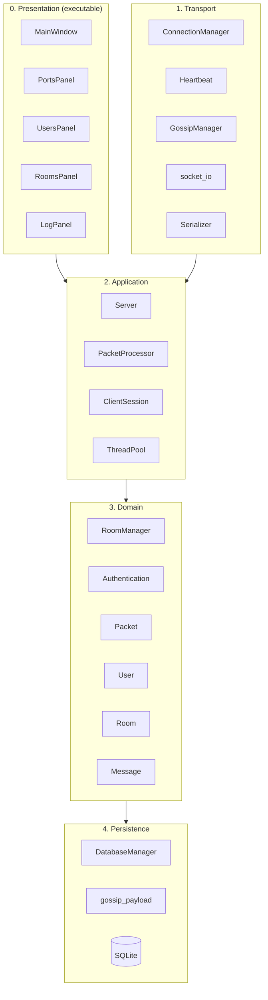
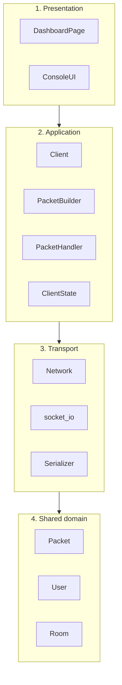
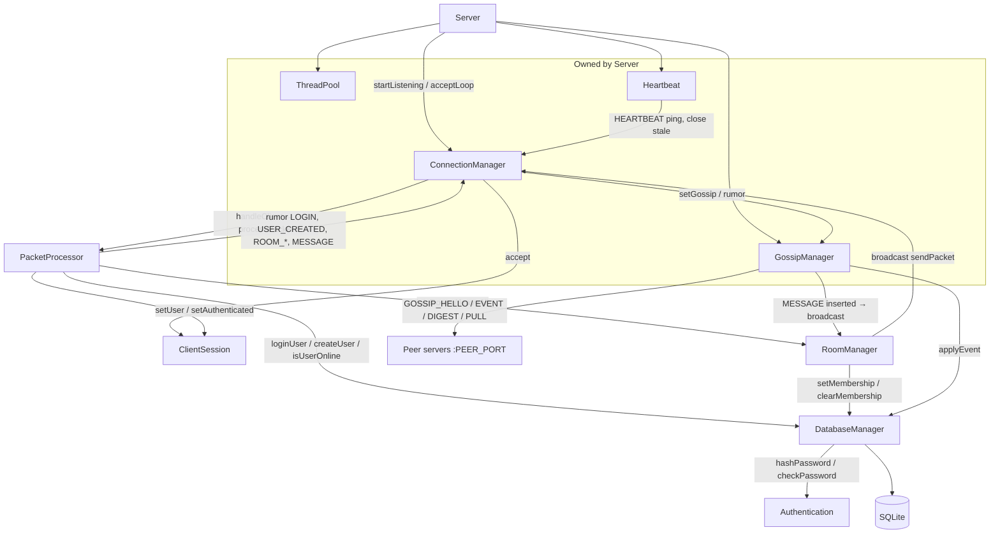
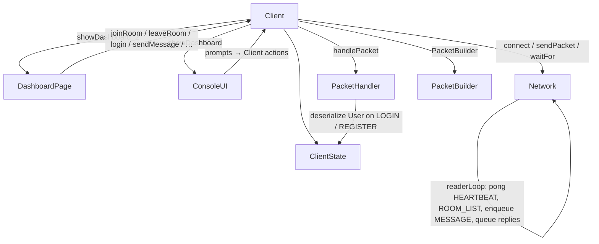
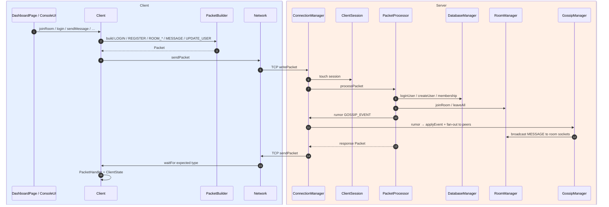

# Architecture

C++17 distributed chat: `chat_server` and `chat_client` are separate processes. They meet only on TCP as framed `Packet`s (`socket_io` + `Serializer`). Cluster nodes also gossip on a peer port. Each binary defaults to a Qt Widgets dashboard; `--test` runs the console UI.

Shared types (`Packet`, `User`, `Room`, `Message`, `Logger`, `gossip_payload`) live in `utils`. They are not a third process. Qt stays in the executables: widgets read `Server*` / `Client*` on the GUI thread and do not live in `server_lib` / `client_lib` domain or transport code.

---

## Layered architecture

Dependencies go downward. Upper layers call lower ones; lower layers do not depend on UI or `PacketProcessor` / `Client`.

### Server

| Layer | Classes | Role |
|-------|---------|------|
| Presentation | `MainWindow`, `PortsPanel`, `UsersPanel`, `RoomsPanel`, `LogPanel` | Qt dashboard; timer refresh from `config`, sessions, rooms, `Logger` |
| Transport | `ConnectionManager`, `Heartbeat`, `GossipManager`, `socket_io`, `Serializer` | Accept clients, ping/drop sockets, rumor to peers, frame bytes |
| Application | `Server`, `PacketProcessor`, `ClientSession`, `ThreadPool` | Lifecycle, route each packet, per-socket auth/room state |
| Domain | `RoomManager`, `Authentication`, `Packet`, `User`, `Room`, `Message` | Membership, broadcast rules, password hash/verify, wire types |
| Persistence | `DatabaseManager`, `gossip_payload`, SQLite | Users, online presence, membership, message history, event bodies |

### Client

| Layer | Classes | Role |
|-------|---------|------|
| Presentation | `DashboardPage`, `ConsoleUI` | Qt dashboard + dialogs, or console menus (`--test`) |
| Application | `Client`, `PacketBuilder`, `PacketHandler`, `ClientState` | Action methods (`joinRoom`, `login`, …), parse replies, remember user/room |
| Transport | `Network`, `socket_io`, `Serializer` | Connect, send, reader thread (pong heartbeats, `ROOM_LIST` / `MESSAGE` pushes) |
| Shared domain | `Packet`, `User`, `Room` | Same models as the server wire |

---

## Server class interactions

---

## Client class interactions

`Network` is the only client class that talks to the server. Widgets and `ConsoleUI` never touch a socket; they call `Client` on the UI / main thread. `MESSAGE` pushes are queued under a mutex and drained on the Qt timer (not from the reader thread).

---

## Across the wire

Processes stay separate. Only `Network` and `ConnectionManager` share a TCP connection.

Heartbeat is out of band: `Heartbeat` pings every session; `Network::readerLoop` replies `pong` and does not queue those packets for `Client`. Room directory and chat pushes use `responseCode == 0` and the push handler, not `waitFor`.
