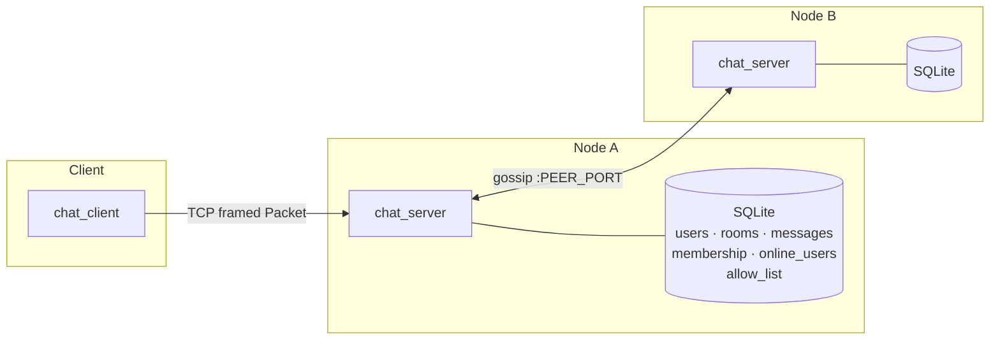
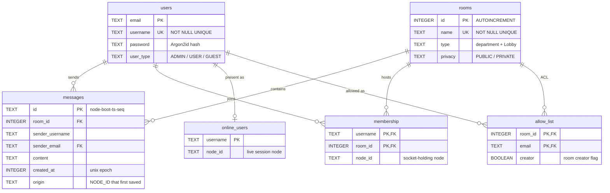
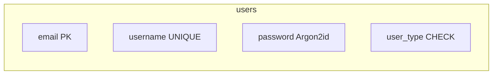
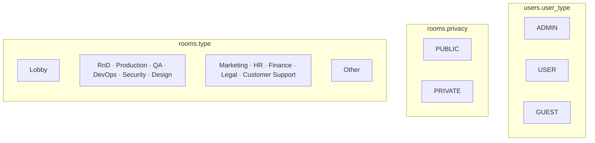
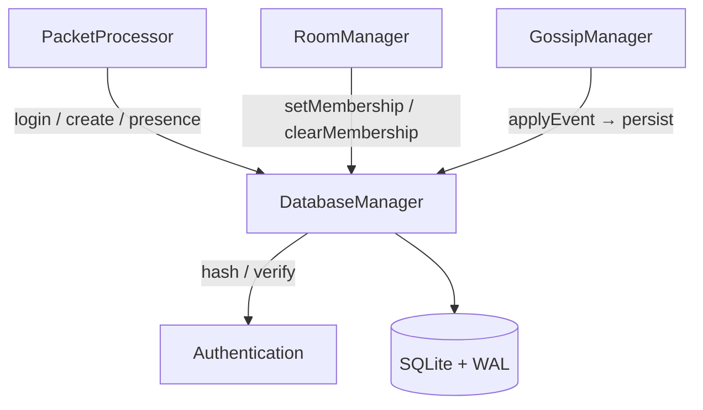
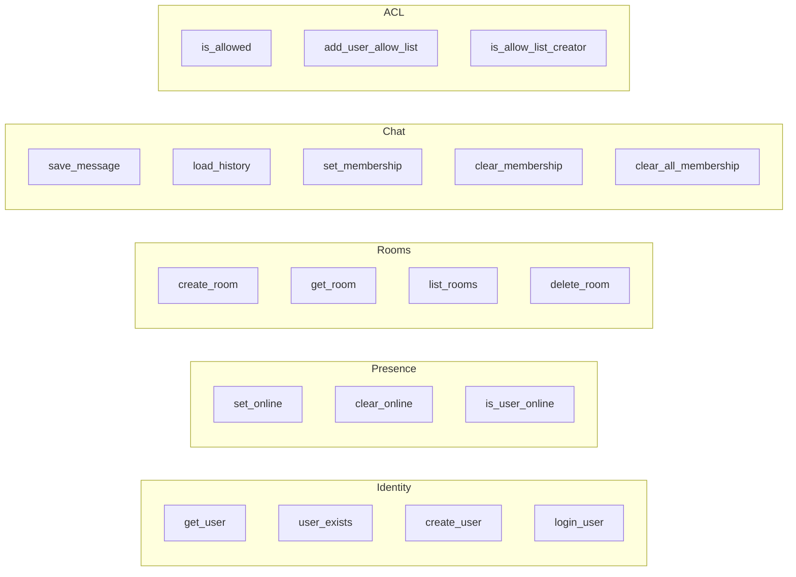
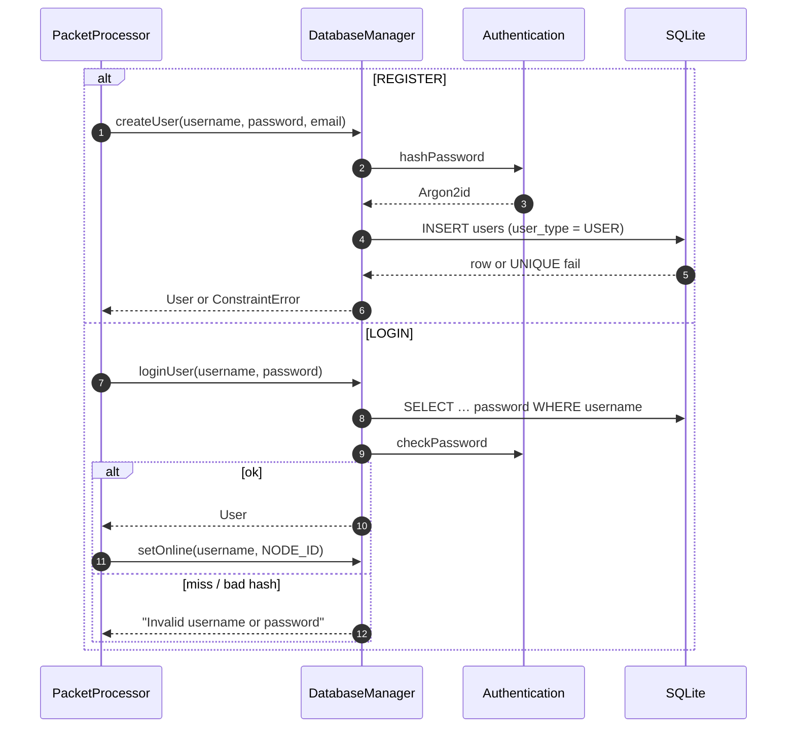
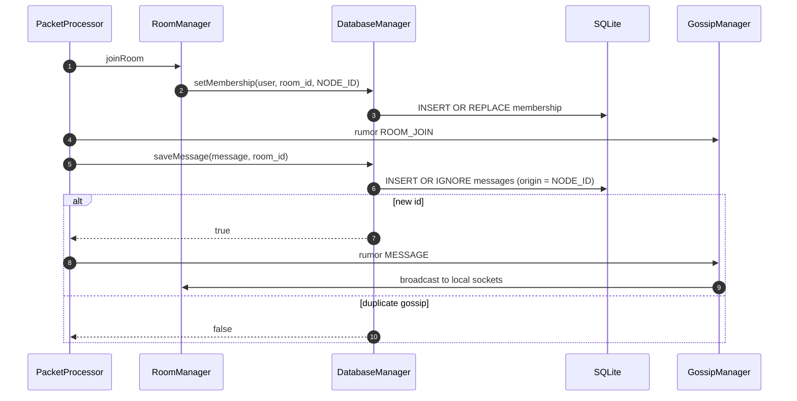
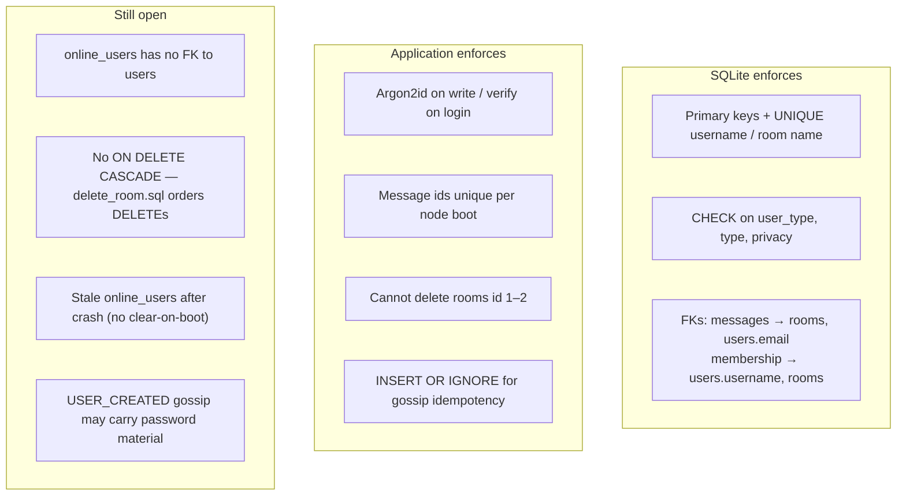

# Database

Each `chat_server` node owns a local SQLite file (default `data/node-1.db`). There is no shared remote store: presence, membership, and messages replicate by gossip. `DatabaseManager` is the only class that turns SQL rows into `User` / `Room` / `Message`.

Schema source of truth: `src/database/init.sql`. Queries live in `src/database/queries/`.

**Related docs:** [README.md](README.md), [architecture.md](architecture.md) (who calls `DatabaseManager`), [tests/TESTS.md](tests/TESTS.md), [STEPS.md](STEPS.md).

---

## Placement in the cluster



On open, `DatabaseManager` creates parent directories, then:

```sql
PRAGMA journal_mode=WAL;
PRAGMA foreign_keys=ON;
```

Busy timeout is 5 s. WAL lets readers proceed while a writer holds the mutex.

---

## Entity-relationship model



| From | To | Cardinality | Join |
|------|----|-------------|------|
| `users.email` | `messages.sender_email` | 1 : N | FK |
| `rooms.id` | `messages.room_id` | 1 : N | FK |
| `users.username` | `membership.username` | 1 : N | FK |
| `rooms.id` | `membership.room_id` | 1 : N | FK |
| `users.username` | `online_users.username` | 1 : 0..1 | same key, **no FK** |
| `rooms.id` | `allow_list.room_id` | 1 : N | FK |
| `users.email` | `allow_list.email` | 1 : N | FK |

`membership` is a composite primary key `(username, room_id)`: one row per user per room, with `node_id` recording which cluster node holds that user’s socket in the room.

`allow_list` is a composite primary key `(room_id, email)`: who may join a **PRIVATE** room (and who is the creator). Public joins may also seed allow-list rows for registered users.

---

## Tables

### `users`

Identity and credentials. Domain `User` maps `username`, `email`, `user_type` — never the hash.

| Column | Type | Constraints |
|--------|------|-------------|
| `email` | `TEXT` | `PRIMARY KEY` |
| `username` | `TEXT` | `NOT NULL UNIQUE` |
| `password` | `TEXT` | `NOT NULL` — Argon2id |
| `user_type` | `TEXT` | `NOT NULL CHECK (ADMIN, USER, GUEST)` |

New accounts are always `USER`. `ADMIN` exists in seed data; privilege checks are not enforced yet.



### `rooms`

Chat spaces. `id` is assigned by SQLite `AUTOINCREMENT` (`sqlite3_last_insert_rowid`); the `Room` constructor does not invent ids.

| Column | Type | Constraints |
|--------|------|-------------|
| `id` | `INTEGER` | `PRIMARY KEY AUTOINCREMENT` |
| `name` | `TEXT` | `NOT NULL UNIQUE` |
| `type` | `TEXT` | `NOT NULL CHECK` (see enums) |
| `privacy` | `TEXT` | `NOT NULL CHECK (PUBLIC, PRIVATE)` |

Ids **1** (Lobby) and **2** (General) are seed rooms. `deleteRoom` refuses `id < 3`.

`PRIVATE` rooms require an `allow_list` hit (authenticated + listed). Guests cannot join private rooms. Creators are seeded on `ROOM_CREATE`; others via `ROOM_INVITE` / gossip `ROOM_ACL_ADD`.

### `messages`

Persisted chat. Ids are generated in process as `{NODE_ID}-{boot}-{unix}-{seq}` so gossip `INSERT OR IGNORE` is idempotent across the cluster.

| Column | Type | Constraints |
|--------|------|-------------|
| `id` | `TEXT` | `PRIMARY KEY` |
| `room_id` | `INTEGER` | `NOT NULL` → `rooms(id)` |
| `sender_username` | `TEXT` | `NOT NULL` |
| `sender_email` | `TEXT` | `NOT NULL` → `users(email)` |
| `content` | `TEXT` | `NOT NULL` |
| `created_at` | `INTEGER` | `NOT NULL` unix time |
| `origin` | `TEXT` | `NOT NULL` — first-write `NODE_ID` |

History load is newest-first, capped at 100, with a `LEFT JOIN` so a missing user still yields `GUEST`.

### `membership`

Who is in which room, and on which node.

| Column | Type | Constraints |
|--------|------|-------------|
| `username` | `TEXT` | PK part → `users(username)` |
| `room_id` | `INTEGER` | PK part → `rooms(id)` |
| `node_id` | `TEXT` | `NOT NULL` |

Written with `INSERT OR REPLACE`. Leave / logout delete the row(s). Room delete clears membership for that `room_id` first.

### `online_users`

Cluster-wide “who is logged in.” One row per username; `node_id` is the node that owns the live TCP session.

| Column | Type | Constraints |
|--------|------|-------------|
| `username` | `TEXT` | `PRIMARY KEY` |
| `node_id` | `TEXT` | `NOT NULL` |

No foreign key: a crash can leave a stale row. Clearing presence on boot is still an open item (see [STEPS.md](STEPS.md)).

### `allow_list`

Who may enter a private room, keyed by user email.

| Column | Type | Constraints |
|--------|------|-------------|
| `room_id` | `INTEGER` | PK part → `rooms(id)` |
| `email` | `TEXT` | PK part → `users(email)` |
| `creator` | `BOOLEAN` | `NOT NULL` — `1` for room creator |

APIs: `isAllowed`, `addToAllowList`, creator check for invite. `delete_room.sql` clears allow-list rows before membership / messages / room.

---

## Constrained enums

SQLite stores readable `TEXT` with `CHECK` so the set stays stable if C++ enum order changes. Mappers: `User::typeToString` / `stringToType`, `Room::roomTypeToString` / `stringToRoomType`, `privacyToString` / `stringToPrivacy`.



| DB value | C++ |
|----------|-----|
| `ADMIN` / `USER` / `GUEST` | `User::UserType` |
| `PUBLIC` / `PRIVATE` | `Room::Privacy` |
| `R&D` | `RoomType::RESEARCH_AND_DEVELOPMENT` |
| `Production` … `Customer Support` | matching `RoomType` |
| `Other` | `RoomType::OTHER` |
| `Lobby` | `RoomType::LOBBY` |

---

## Access layer



`DatabaseManager` is a process singleton: one connection, one mutex around prepare/bind/step. It:

- Maps rows → objects (`userFromRow`, `roomFromRow`, `messageFromRow`)
- Hashes on create, verifies on login — hashes never sit on domain objects
- Throws `ConstraintError` on unique/PK collisions (`User already exists`, `Room already exists`)

Gossip event ids and the in-memory rumor log are **not** tables. Only domain state is in SQLite.

---

## Query catalog

Prepared SQL under `src/database/queries/`. Parameters are positional `?`.



| API | SQL | Effect |
|-----|-----|--------|
| `getUser` | `get_user.sql` | `username, email, user_type` by username |
| `userExists` | `user_exists.sql` | existence probe |
| `createUser` | `create_user.sql` | insert hashed `USER` |
| `loginUser` | `login_user.sql` | select including hash, then Argon2 verify |
| `updateUser` | matching files | password and/or username change |
| `saveMessage` | `save_message.sql` | `INSERT OR IGNORE` — false if id already seen |
| `loadHistory` | `load_history.sql` | last 100 in room, newest first |
| `setMembership` | `set_membership.sql` | upsert `(username, room_id, node_id)` |
| `clearMembership` | `clear_membership.sql` | drop one room |
| `clearAllMembership` | `clear_all_membership.sql` | drop all rooms for user |
| `isUserOnline` | `is_user_online.sql` | presence probe |
| `setOnline` / `clearOnline` | matching files | upsert / delete presence |
| `createRoom` | `create_room.sql` | insert; id from `last_insert_rowid` |
| `getRoom` / `listRooms` | matching files | by id / all rows |
| `deleteRoom` | `delete_room.sql` | allow_list → membership → messages → room |
| `isAllowed` | `is_allowed.sql` | private-room ACL probe |
| `addToAllowList` | `add_user_allow_list.sql` | upsert ACL row (`creator` flag) |

`delete_room.sql` orders deletes (schema has no `ON DELETE CASCADE`):

```sql
DELETE FROM allow_list WHERE room_id = ?;
DELETE FROM membership WHERE room_id = ?;
DELETE FROM messages WHERE room_id = ?;
DELETE FROM rooms WHERE id = ?;
```

---

## Write paths

### Register and login



### Join room and send message



Logout clears `online_users` and all `membership` rows for that username, then rumors `LOGOUT`.

---

## Seed data

Applied with `INSERT OR IGNORE` so a second boot does not clash.

| `users` | email | type |
|---------|-------|------|
| `omri` | `omri@gmail.com` | `USER` |
| `spitzer` | `spitzer@gmail.com` | `USER` |
| `admin` | `admin@gmail.com` | `ADMIN` |

Seed password strings are **placeholders**, not real Argon2 hashes.

| `rooms` | name | type | privacy |
|---------|------|------|---------|
| `1` | Lobby | `Lobby` | `PUBLIC` |
| `2` | General | `Other` | `PUBLIC` |

---

## Integrity notes



Passwords leave the database only inside `loginUser` for verification, then are dropped. `User` objects on the wire and in UI never carry a hash. Private-room gating uses `allow_list` on the join path.
)